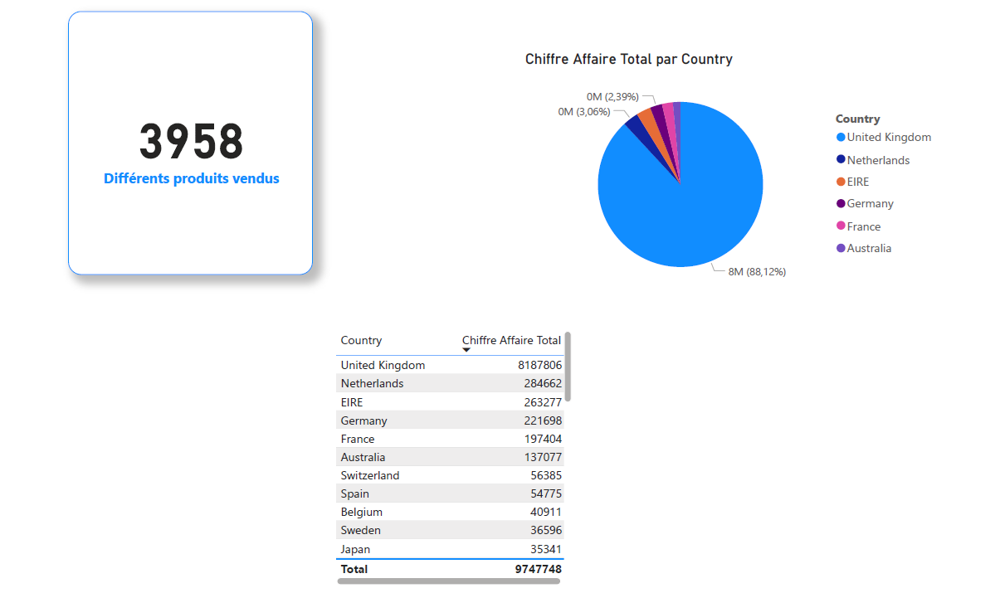
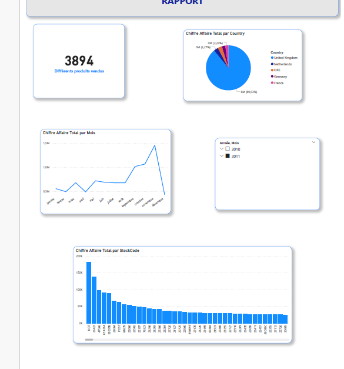

# 📊 Power BI Project — Online Retail Analytics

## 🎯 Objectif
Analyse des ventes d’un dataset e-commerce afin d’identifier :
- les tendances commerciales
- la rentabilité produit
- la saisonnalité du chiffre d’affaires
- les opportunités d’amélioration business

---

## 🛠️ Stack technique
- Power BI (DAX, Power Query)
- Data cleaning & exploration
- KPI modelling
- Data storytelling

---

## 📈 Insights clés
- Royaume-Uni = principal marché
- Les produits déco & maison dominent les ventes
- Forte saisonnalité avec pic en décembre
- Concentration du CA sur le dernier trimestre

## 📊 Dashboard
### Chiffre d'affaire total  par pays

### Analyse globale des ventes

### Rapport

## 💡 Recommandations
- Fidélisation client
- Diversification produits
- Répartition marketing plus homogène

## 🚀 Compétences démontrées
✔ Data cleaning  
✔ Modélisation DAX  
✔ Data visualisation  
✔ Storytelling data  
✔ Business insights  

## 🔗 Fichiers du projet
- PBIX : Online_retail.pbix
- Rapport analytique : Rapport_online-retail.docx